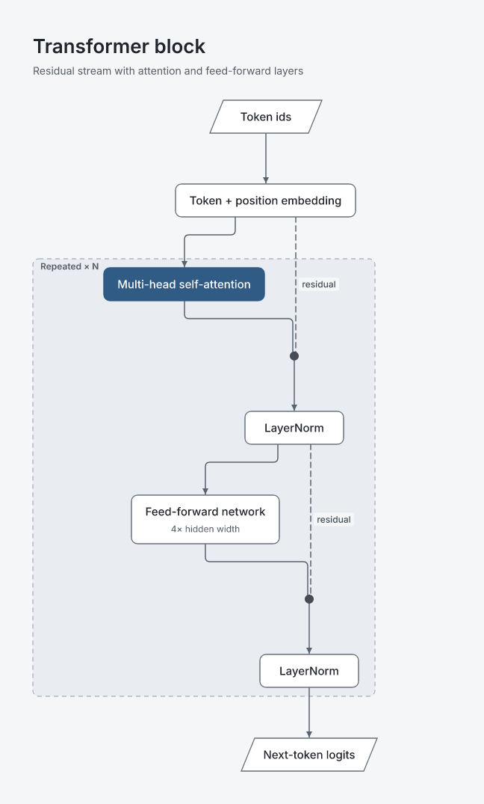
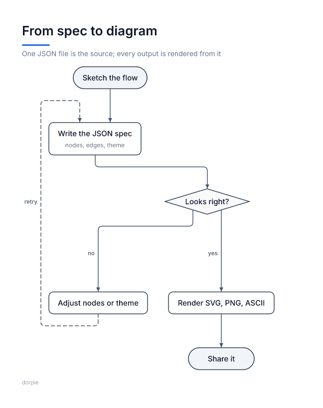
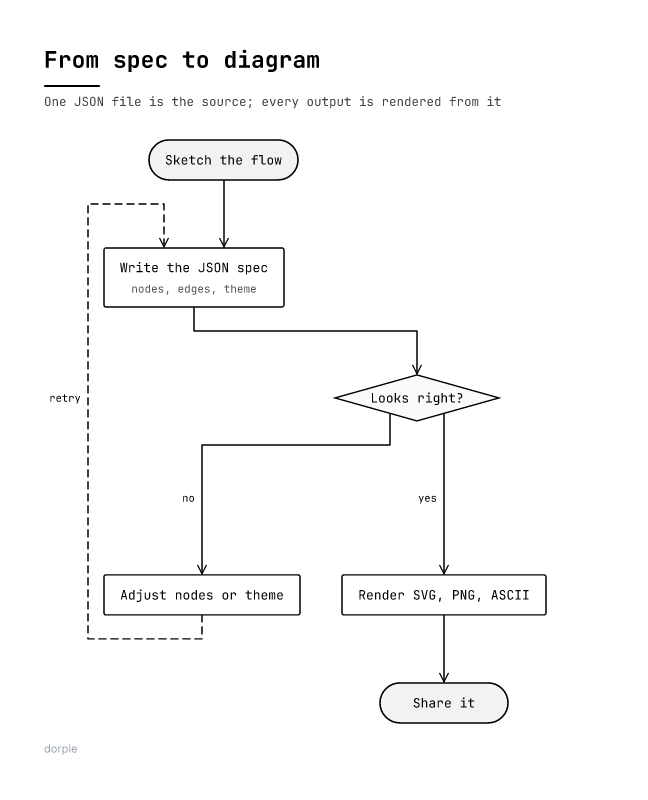
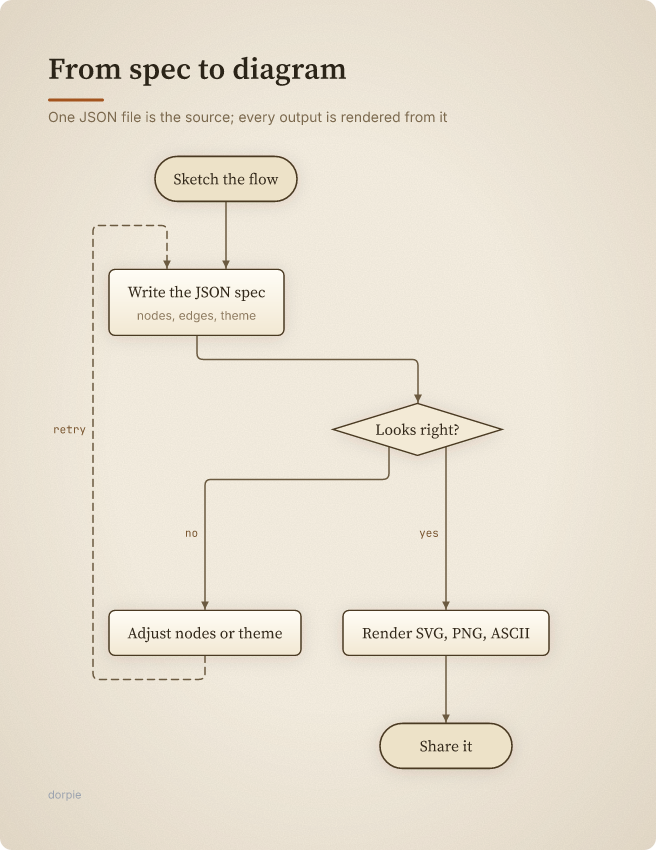
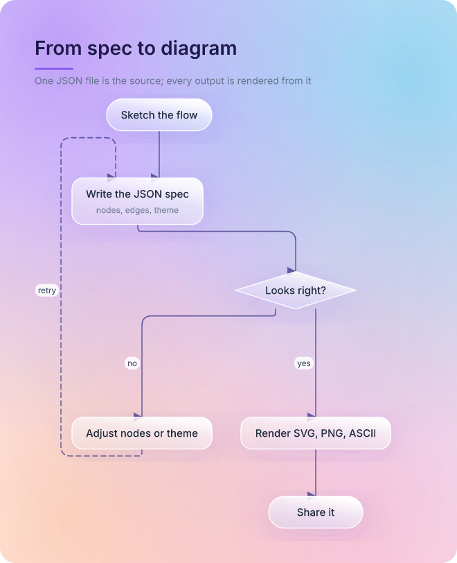
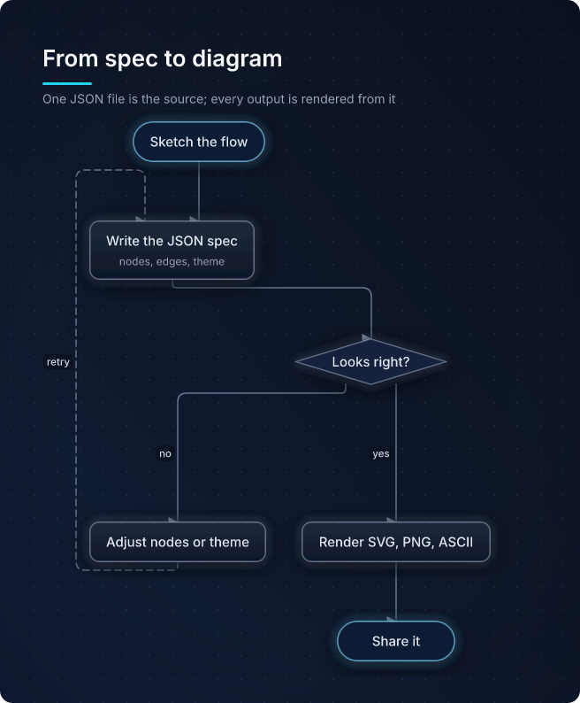
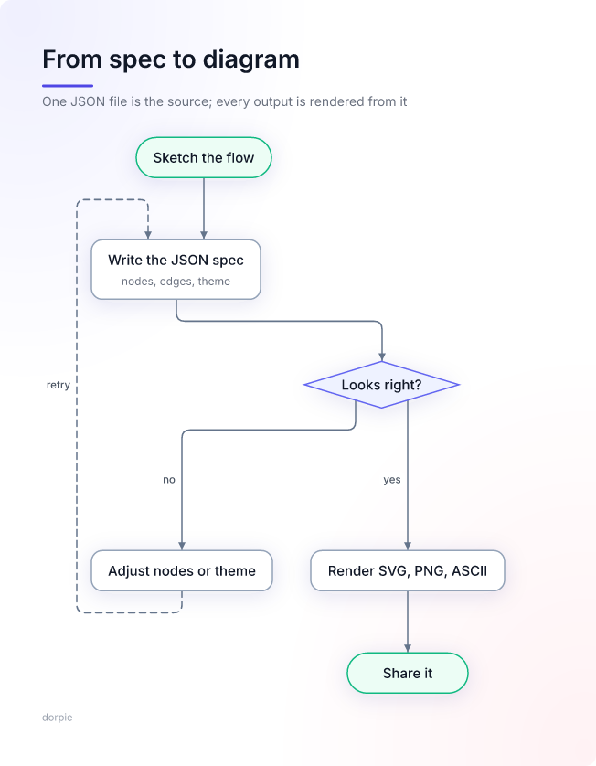
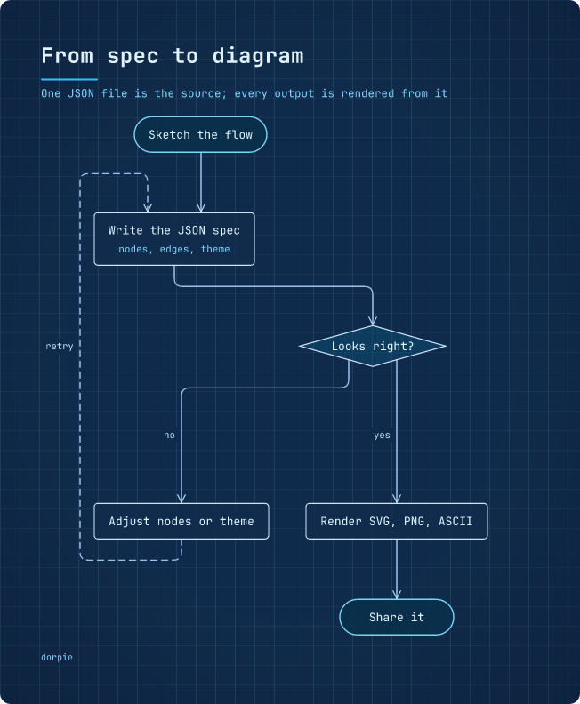
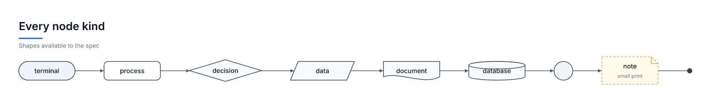

<h1 align="center">DiagramCraft</h1>

<p align="center"><strong>Beautiful diagrams from one JSON file.</strong><br>
Seven complete visual themes, three output formats, no browser and no GUI.<br>
Designed for AI agents, pleasant for humans.</p>

<p align="center">
  
</p>

DiagramCraft turns a plain JSON spec into a finished diagram. The spec is the source of truth: you edit nodes and edges there and re-render, so “add one more block” is a two-line change instead of a redraw. Every theme is a full visual system — its own typography, shapes, line work, background and composition — not the same picture recoloured.

Everything runs locally in Node. No headless browser, no network calls, no accounts. A typical diagram renders in well under a second.

## Install

```sh
# from the GitHub release (works today)
npm install -g https://github.com/Krablante/diagramcraft/releases/latest/download/diagramcraft-0.1.0.tgz

# from the repository
npm install -g github:Krablante/diagramcraft

# once the npm package is published
npm install -g diagramcraft
npx diagramcraft --help
```

Node 20 or newer. SVG works everywhere; PNG needs no system libraries (fonts are bundled); ASCII needs nothing at all. Publishing to npm is pending a valid automation token; the release tarball is byte-for-byte the npm package.

## 30-second quickstart

```sh
diagramcraft init hello.json      # writes a starter spec
diagramcraft render hello.json    # writes hello.svg, hello.png, hello.txt
```

```jsonc
{
  "title": "Deploy flow",
  "theme": "paper",
  "nodes": [
    { "id": "start", "kind": "terminal", "label": "Push to main" },
    { "id": "build", "kind": "process", "label": "Build and test" },
    { "id": "ok", "kind": "decision", "label": "Green?" },
    { "id": "ship", "kind": "terminal", "label": "Ship it" }
  ],
  "edges": [
    { "from": "start", "to": "build" },
    { "from": "build", "to": "ok" },
    { "from": "ok", "to": "ship", "label": "yes" },
    { "from": "ok", "to": "build", "label": "no", "kind": "dashed" }
  ]
}
```

`diagramcraft render spec.json --theme glass --format png --scale 2` and `--out` control the output. `diagramcraft schema` prints the full JSON Schema, `diagramcraft themes` lists every theme, and `diagramcraft themes paper` prints a theme you can edit.

## For AI agents

The whole product is built around one loop:

1. Write or edit the spec (JSON). Never edit the generated files.
2. `diagramcraft validate spec.json` — structured errors with paths.
3. `diagramcraft render spec.json --format svg,png,ascii`.
4. Look at the PNG (vision) or the ASCII, fix the spec, render again.

`docs/agents.md` has a ready-to-paste system prompt, theme selection guidance and common mistakes. The programmatic API is just as small:

```js
import { render } from "diagramcraft";

const { svg, png, ascii } = await render(spec, {
  theme: "glass",                 // built-in id or path to a theme JSON
  formats: ["svg", "png", "ascii"],
});
```

## Themes

Each theme is a complete system: fonts, line weights, node fills, arrowheads, backgrounds, textures and composition. Pick one by intent.

| | |
|---|---|
|  **Classic** — neutral flowcharts, crisp and familiar |  **Mono** — black-and-white print, monospace |
|  **Paper** — warm printed page, serif, paper grain |  **Glass** — liquid glass over colour fields |
|  **Midnight** — dark navy, soft glows |  **Vivid** — colour-coded shapes, indigo accent |
|  **Blueprint** — engineering grid, technical lines |  **Every shape** — terminal, decision, data, document, database, connector, note, junction |

Themes are data. Copy one with `diagramcraft themes paper > my-theme.json`, change what you want, and render with `--theme my-theme.json`. Small tweaks stay in the spec:

```json
{ "theme": "glass", "style": { "fonts": { "title": { "color": "#4338ca" } } } }
```

See [docs/themes.md](./docs/themes.md) for the full token reference.

## Formats

**SVG** is the primary output: fully vector, editable in any editor, small and sharp. **PNG** is rasterised locally with bundled Open Font License fonts, so the result is identical on every machine. **ASCII** uses Unicode box drawing and lays out on a character grid — useful in terminals, diffs and for cheap agent iteration; `--charset ascii` falls back to `+ - |` for plain environments. `--transparent` drops the canvas background for slides and docs.

## Examples

- `examples/quickstart.json` — the smallest useful diagram
- `examples/buro-draft-workflow.json` — how a change lands in a revision-checked registry (Paper)
- `examples/opencodez-release.json` — release flow from upstream tag to verified hosts (Vivid, with zones)
- `examples/opencodebot-artifact.json` — how a file reaches a Telegram topic (Blueprint)
- `examples/transformer-block.json` — a residual transformer block with junction merges (Glass)
- `examples/node-shapes.json` — every node kind in one diagram

## CLI

```
diagramcraft render <spec.json|-> [--theme id|file] [--format svg,png,ascii]
                                 [--out path|->] [--scale n] [--transparent]
                                 [--system-fonts] [--charset unicode|ascii]
diagramcraft validate <spec.json|-> [--json]
diagramcraft themes [id] [--json]
diagramcraft schema
diagramcraft init [file.json] [--force]
```

Render writes files next to the spec by default and prints their paths. `--out -` streams a single format to stdout.

## Documentation

- [docs/spec.md](./docs/spec.md) — every field, node kind and option
- [docs/themes.md](./docs/themes.md) — how themes work, how to write one
- [docs/agents.md](./docs/agents.md) — the agent workflow and system prompt

## License

MIT. Bundled fonts (Inter, Source Serif 4, JetBrains Mono) are licensed under the SIL Open Font License; their licenses ship in `assets/fonts/LICENSES/`.
