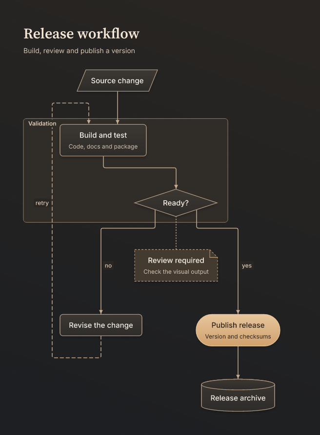
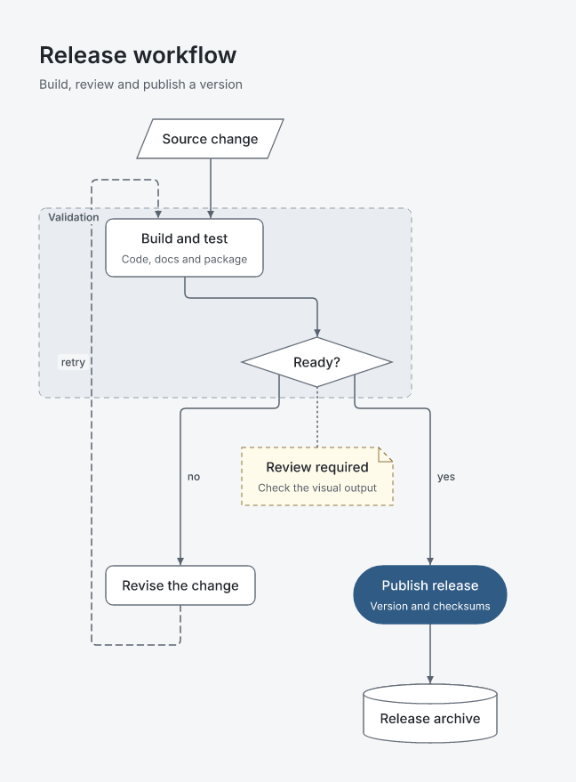
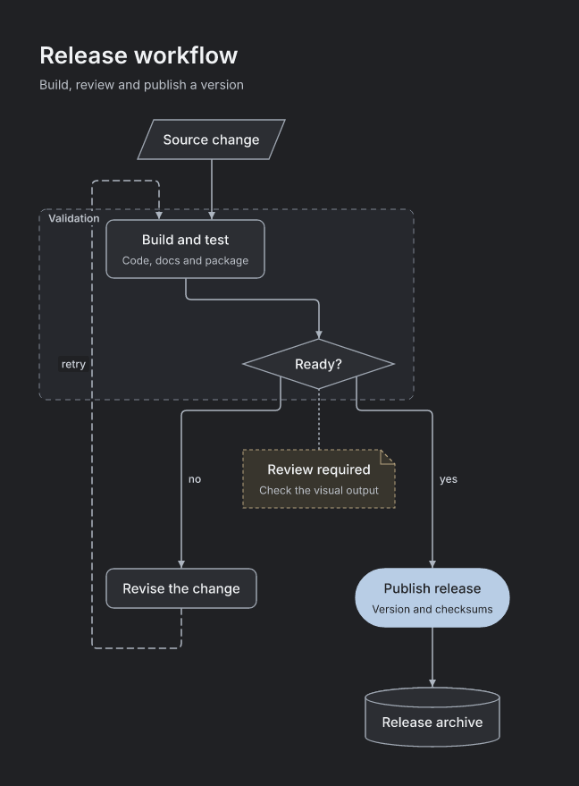

<h1 align="center">Dorpie</h1>

<p align="center"><strong>Опишите в JSON. Получите диаграмму. Вернитесь к ней в следующей сессии.</strong><br>
Восемь визуальных тем · SVG, PNG и ASCII · CLI, Node API и инструменты OpenCode</p>

<p align="center">
  <a href="./README.md">English</a> · <a href="./README.ru.md">Русский</a>
</p>

<p align="center">
  
</p>

Dorpie — консольная утилита, библиотека для Node и плагин OpenCode/OpenCodez: она рендерит диаграмму, описанную одним JSON-файлом, в SVG, PNG и ASCII. Спека — источник истины: вы один раз описываете узлы и связи и рендерите из них все форматы, так что «добавить ещё один блок» остаётся правкой в две строки, а не перерисовкой. Сохранённые диаграммы хранят версии исходников и историю экспортов между сессиями агента.

Всё работает локально в Node: без headless-браузера, сетевых запросов во время рендера и аккаунтов. Dorpie подходит для инструкции, наброска архитектуры, схемы релиза или диаграммы, которую агент будет дорабатывать позже. Каждая тема задаёт шрифты, формы, линии и фон как единое целое.

## Установка

Нужен Node 20 или новее. Пакет распространяется как tarball во вложениях GitHub-релизов:

```sh
npm install -g https://github.com/Krablante/dorpie/releases/download/v0.4.0/dorpie-0.4.0.tgz
dorpie --version
```

Можно поставить и прямо из репозитория — тогда будет отслеживаться ветка `main`:

```sh
npm install -g github:Krablante/dorpie
```

Публикации в npm пока нет, поэтому `npm install -g dorpie` не сработает.

## Быстрый старт

Для подключения установленного пакета к OpenCodez выполните `dorpie plugin install --app opencodez` и перезапустите бэкенд. Для upstream OpenCode используйте `--app opencode`. Второй пакет или сервис не нужен. См. [установку плагина и инструменты](./docs/plugin.ru.md).

```sh
dorpie init hello.json      # создаёт стартовую спеку
dorpie render hello.json    # пишет hello.svg, hello.png и hello.txt
```

`init` запрашивает все три формата, так что рендер кладёт файлы рядом со спекой и печатает их пути. Дальше правьте JSON и рендерите снова:

```jsonc
{
  "version": 1,
  "title": "Деплой",
  "theme": "paper",
  "direction": "TB",
  "output": { "formats": ["svg", "png", "ascii"] },
  "nodes": [
    { "id": "start", "kind": "terminal", "label": "Пуш в main" },
    { "id": "build", "kind": "process", "label": "Сборка и тесты" },
    { "id": "ok", "kind": "decision", "label": "Зелёный?" },
    { "id": "ship", "kind": "terminal", "label": "Выкатка" }
  ],
  "edges": [
    { "from": "start", "to": "build" },
    { "from": "build", "to": "ok" },
    { "from": "ok", "to": "ship", "label": "да" },
    { "from": "ok", "to": "build", "label": "нет", "kind": "dashed" }
  ]
}
```

`dorpie validate spec.json` проверяет спеку без рендера и показывает все проблемы с JSON-путями. Флаги CLI перекрывают спеку: `dorpie render spec.json --theme light --format png --scale 2 --out out/`. Полный справочник команд — в [docs/cli.ru.md](./docs/cli.ru.md).

Для работы, к которой нужно вернуться позже, используйте `dorpie save spec.json --name "Deploy flow"`, затем `dorpie export <полученный-id>`. Команды `dorpie list`, `get` и `history` находят прежние диаграммы и их версии. CLI и плагин используют одну настраиваемую библиотеку; экспорты сохраняют собственные файлы, снимок исходника и тему. См. [сохранённые диаграммы и настройки](./docs/library.ru.md).

## Форматы вывода

**SVG** — основной формат: чистый вектор, редактируется в любом векторном редакторе, компактный и резкий. **PNG** растрируется локально встроенными шрифтами под Open Font License через resvg — без браузера, системных шрифтов и сети. **ASCII** раскладывает ту же диаграмму по символьной сетке псевдографикой; его удобно читать в терминале и дешёво сравнивать в диффах, а `--charset ascii` переключает рамки на `+`, `-` и `|`.

`--transparent` убирает фон холста для слайдов и документации, `--scale` задаёт множитель PNG (по умолчанию 2), а `--system-fonts` разрешает запасной вариант из системных шрифтов, если тема использует семейство, которого нет среди встроенных.

## Темы

Classic подходит для привычных блок-схем, Mono — для чёрно-белой печати, Light и Dark — под фон документа. Paper и Copper добавляют тонкую фактуру и неглубокие тени, Blueprint — сдержанную чертёжную сетку. В Vivid цвет помогает различать виды узлов, а формы остаются читаемыми.

| | |
|---|---|
|  **Classic** — нейтральные блок-схемы, чёткие и привычные |  **Mono** — чёрно-белая печать, моноширинный шрифт |
|  **Light** — мягкий серый фон, белые узлы, сдержанный синий |  **Dark** — графитовые поверхности, чёткие контуры, светло-синий акцент |
|  **Paper** — светлая бумажная фактура, антиква, лёгкий рельеф |  **Copper** — графитовая фактура, тёплые блики, объёмные поверхности |
|  **Vivid** — приглушённые цвета по видам узлов, зелёный акцент |  **Blueprint** — тонкая синяя сетка, чертёжные линии, открытые стрелки |

Прежние id `glass` и `midnight` выбирают `light` и `dark`. Старые спеки продолжают рендериться; новые экспорты записывают тему-замену. Ранее сохранённые экспорты сохраняют исходные файлы и снимки тем. См. [все формы узлов](./docs/gallery/node-shapes.png) и [справочник тем](./docs/themes.ru.md).

Темы — это данные. Возьмите встроенную тему за основу: `dorpie themes paper > my-theme.json`, меняйте что нужно и рендерите с `--theme my-theme.json`. Небольшие правки можно оставить в спеке:

```json
{ "theme": "light", "style": { "fonts": { "title": { "color": "#305b85" } } } }
```

Полный справочник токенов и руководство по созданию темы — в [docs/themes.ru.md](./docs/themes.ru.md).

## Для ИИ-агентов

Весь продукт построен вокруг одного цикла:

1. Написать или отредактировать спеку (JSON). Сгенерированные файлы не редактировать.
2. `dorpie validate spec.json` — структурированные ошибки с путями.
3. `dorpie render spec.json --format svg,png,ascii`.
4. Посмотреть на PNG (vision) или ASCII, поправить спеку и отрендерить снова.

В [docs/agents.ru.md](./docs/agents.ru.md) есть готовый системный промпт, советы по выбору темы и типичные ошибки. Если Dorpie нужен из кода, а не из оболочки, используйте программный API:

```js
import { render } from "dorpie";

const { svg, png, ascii } = await render(spec, {
  theme: "light",                 // встроенный id или путь к JSON-файлу темы
  formats: ["svg", "png", "ascii"],
});
```

Полное описание API — в [docs/api.ru.md](./docs/api.ru.md).

## Примеры

- `examples/quickstart.json` — самая маленькая полезная диаграмма
- `examples/buro-draft-workflow.json` — как изменение попадает в реестр с проверкой ревизий (Paper)
- `examples/opencodez-release.json` — выпуск от апстрим-тега до проверенных хостов (Vivid, с зонами)
- `examples/opencodebot-artifact.json` — как файл попадает в Telegram-топик (Blueprint)
- `examples/transformer-block.json` — residual-блок трансформера со слияниями на junction (Light)
- `examples/theme-preview.json` — выпуск с группой, развилками, заметками и акцентом; общая схема для сравнения тем
- `examples/node-shapes.json` — все виды узлов на одной схеме

## Документация

- [docs/cli.ru.md](./docs/cli.ru.md) — команды, флаги, коды возврата, типичные проблемы
- [docs/spec.ru.md](./docs/spec.ru.md) — все поля спеки, виды узлов, значения по умолчанию
- [docs/themes.ru.md](./docs/themes.ru.md) — токены тем и как написать свою
- [docs/api.ru.md](./docs/api.ru.md) — Node API для встраивания Dorpie
- [docs/agents.ru.md](./docs/agents.ru.md) — рабочий цикл агента и системный промпт
- [docs/plugin.ru.md](./docs/plugin.ru.md) — установка OpenCode/OpenCodez и инструменты агента
- [docs/library.ru.md](./docs/library.ru.md) — сохранённые диаграммы, версии, экспорты и настройки
- [CONTRIBUTING.ru.md](./CONTRIBUTING.ru.md) — локальная разработка, архитектура и релизы
- [CHANGELOG.ru.md](./CHANGELOG.ru.md) — история версий

Английские страницы используют базовое имя файла, переводы добавляют код языка: например, `cli.ru.md`. На каждой странице есть ссылки на доступные языки. Для новых языков действует то же правило; см. [руководство разработчика](./CONTRIBUTING.ru.md#документация).

## Лицензия

MIT. Встроенные шрифты (Inter, Source Serif 4, JetBrains Mono) распространяются по SIL Open Font License; их лицензии лежат в `assets/fonts/LICENSES/`.
